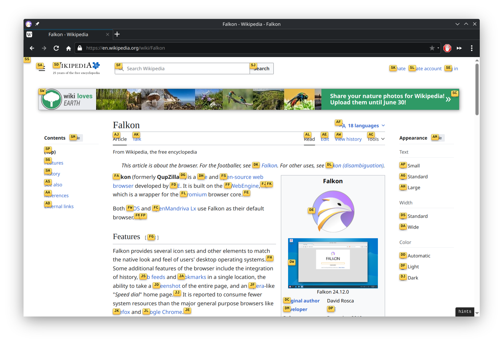

# Vimium for Falkon

> **Disclaimer:** This project's code was written by an LLM (AI). Review it
> before use and run it at your own risk.

<p align="center">
  
</p>

A native [Vimium](https://vimium.github.io/)-style keyboard-navigation plugin for the
[Falkon](https://falkon.org/) web browser, written as a Falkon **Python (PySide6) extension**.

It injects an isolated content script into every page for the in-page features
(scrolling, link hints, find, …) and uses a `QWebChannel` bridge to drive
browser-level actions (tabs, opening URLs in new tabs, focusing the address bar)
from Python.



## Keyboard shortcuts

These mirror Vimium's defaults.

### Scrolling
| Key | Action |
| --- | --- |
| `j` / `k` | Scroll down / up |
| `h` / `l` | Scroll left / right |
| `d` / `u` | Scroll half a page down / up |
| `gg` / `G` | Scroll to top / bottom |

### Links & inputs
| Key | Action |
| --- | --- |
| `f` | Link hints — open link in the current tab |
| `F` | Link hints — open link in a new tab |
| `gi` | Focus the first text input |
| `r` | Reload the page |

### Clipboard
| Key | Action |
| --- | --- |
| `yy` | Copy the current URL |
| `p` / `P` | Open the clipboard's URL in the current / new tab |

### Find
| Key | Action |
| --- | --- |
| `/` | Enter find mode |
| `n` / `N` | Next / previous match |

### Tabs & history
| Key | Action |
| --- | --- |
| `t` | New tab |
| `x` / `X` | Close tab / restore closed tab |
| `J` / `K` | Previous / next tab |
| `<` / `>` | Move current tab left / right |
| `g0` / `g$` | First / last tab |
| `yt` | Duplicate the current tab |
| `H` / `L` | History back / forward |
| `o` | Focus the address bar (vomnibar) |

### Modes
| Key | Action |
| --- | --- |
| `i` | Insert mode — passes keys through to the page |
| `Esc` | Leave insert/hints/find mode, blur inputs |
| `?` | Toggle the help overlay |

Typing in a text field automatically suspends the shortcuts; press `Esc` to
regain control.

## Requirements

> **Important:** Falkon must be built **with Python/PySide6 plugin support**
> (the `PyFalkon` loader). Some distributions — including openSUSE's stock
> `falkon` package — ship Falkon *without* it. If `Preferences → Extensions`
> has no "Python" entry, your build lacks support and you'll need a Falkon
> built with `-DBUILD_PYTHON_SUPPORT=ON` (PySide6 + shiboken6 dev packages).

Runtime dependencies (provided by Falkon's Python support):
`PySide6.QtCore`, `PySide6.QtWebChannel`, `PySide6.QtWebEngineCore`.

## Install

```sh
./install.sh
```

This copies the `Vimium/` directory to
`~/.config/falkon/plugins/Vimium`. Then open
**Falkon → Preferences → Extensions** and enable **Vimium**.

To install manually:

```sh
mkdir -p ~/.config/falkon/plugins
cp -r Vimium ~/.config/falkon/plugins/
```

## How it works

| File | Role |
| --- | --- |
| `Vimium/vimium.py` | Plugin entry point. Injects the content script into the web profile and attaches a `QWebChannel` to every page on a dedicated JS world (`UserWorld`). |
| `Vimium/bridge.py` | `VimiumBridge` QObject exposed to page JS; its slots act on the active window's `TabWidget`/`WebView`. |
| `Vimium/vimium.js` | The in-page Vimium engine: key handling, scrolling, link hints, find, help overlay. Runs in an isolated world so it never collides with page scripts. |
| `Vimium/qwebchannel.js` | Bundled Qt WebChannel client (so we don't depend on the `qrc:` copy). |

The connector that wires the channel to `window.__vimiumBridge` is inlined in
`vimium.py`. The plugin runs in its own JavaScript world, separate from Falkon's
own `external` channel (`ApplicationWorld`) and from page scripts (`MainWorld`),
which keeps it from interfering with normal browsing.

## Limitations

- The vomnibar keys (`o`, `b`, `T`) map to focusing Falkon's address bar rather
  than a full fuzzy bookmark/tab finder.
- `window.find()` is used for find mode; highlighting follows the engine's
  native behaviour.
- Link hints cover the main frame (not cross-origin iframes).

## Uninstall

**Remove just the plugin:**

```sh
rm -rf ~/.config/falkon/plugins/Vimium
```

Then restart Falkon (or untick it in `Preferences → Extensions`).

**Remove a locally-built, Python-enabled Falkon** (only relevant if you installed
one into `~/.local` to get Python plugin support — see *Requirements*). This
reverts you to the distro's `/usr/bin/falkon`:

```sh
rm -f  ~/.local/bin/falkon
rm -rf ~/.local/lib64/plugins/falkon/PyFalkon.so \
       ~/.local/lib64/libFalkonPrivate.so* \
       ~/.local/lib64/plugins/falkon
rm -f  ~/.local/share/applications/org.kde.falkon.desktop
```

Notes:
- The `~/.local` copy shadows the distro package (it's earlier in `PATH` and its
  `.desktop` overrides the system one), so distro updates won't touch it until
  you remove the files above.
- This leaves your profile/config in `~/.config/falkon` intact. To wipe that too:
  `rm -rf ~/.config/falkon ~/.local/share/falkon`.

## License

Released under the [MIT License](LICENSE).
